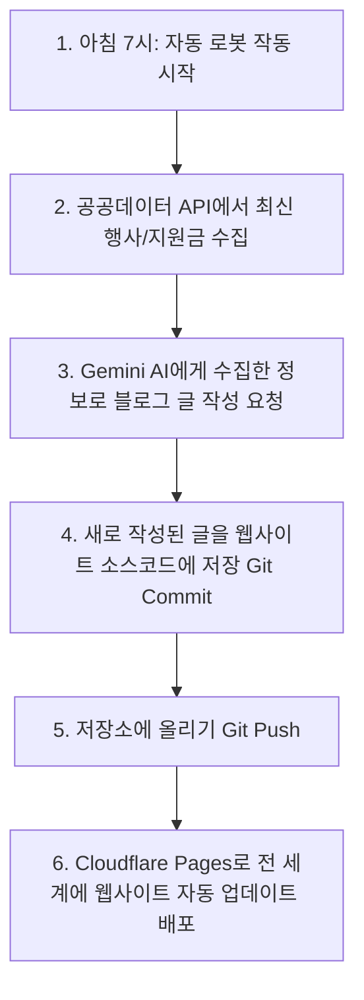

# 📋 프로젝트: 우리 동네 생활 정보 웹사이트 (PROJECT_PLAN)

> **"우리 동네 행사, 축제, 그리고 정부 지원금 정보를 자동으로 모아주고, AI가 매일 글을 써서 광고 수익을 내는 스마트한 웹사이트입니다."**

---

## 🎯 1. 프로젝트 목표
* **자동 정보 수집:** 공공데이터포털(data.go.kr)에서 우리 동네의 축제, 행사, 그리고 받을 수 있는 지원금 혜택을 알아서 가져옵니다.
* **AI 자동 글쓰기:** 똑똑한 AI(Gemini)가 매일 수집된 정보를 바탕으로 사람들이 읽기 좋은 블로그 글을 자동으로 작성합니다.
* **수익화 자동 파이프라인:** 구글 애드센스(광고)와 쿠팡 파트너스(배너)를 연동하여 웹사이트 방문자를 통해 자동으로 수익을 창출합니다.

---

## 🛠️ 2. 기술 스택 (사용하는 도구들)
어려운 기술 용어들을 알기 쉽게 설명해 드릴게요!

| 기술 이름 | 역할 | 초보자를 위한 쉬운 설명 |
| :--- | :--- | :--- |
| **Next.js (App Router)** | 웹사이트 뼈대 및 화면 | 현대적이고 빠른 웹사이트를 만들기 위한 최신 도구입니다. |
| **TypeScript** | 안전 장치 | 코드를 작성할 때 실수를 미리 잡아주는 똑똑한 비서 역할을 합니다. |
| **Tailwind CSS** | 디자인 옷 입히기 | 복잡한 코딩 없이 예쁜 디자인과 레이아웃을 빠르게 만들 수 있게 돕는 도구입니다. |
| **Gemini API** | 인공지능(AI) 작가 | 구글의 최신 AI 모델로, 매일 아침 자동으로 블로그 글을 써주는 역할을 합니다. |
| **공공데이터포털 API** | 정보 우체부 | 정부와 지자체에서 제공하는 실시간 축제/지원금 정보를 배달받는 통로입니다. |
| **GitHub Actions** | 매일 일하는 자동 로봇 | 매일 아침 정해진 시간에 컴퓨터를 켜서 정보를 수집하고 글을 올리도록 지시하는 자동 비서입니다. |
| **Cloudflare Pages** | 인터넷 서버 무료 호스팅 | 우리가 만든 웹사이트를 전 세계 사람들이 접속할 수 있도록 인터넷 세상에 무료로 올려주는 공간입니다. |

---

## 🖥️ 3. 웹사이트 페이지 구성 (화면 설계)
사용자가 보게 될 화면은 총 4개로 아주 심플하고 직관적입니다.

1. **메인 페이지 (홈 화면)**
   * 이번 달에 열리는 핫한 행사/축제 카드 목록
   * 내가 받을 수 있는 동네 지원금/혜택 안내 카드 목록
2. **행사 및 혜택 상세 페이지**
   * 특정 행사나 지원금 카드를 클릭하면 나오는 상세한 정보 (일시, 장소, 신청 방법 등)
3. **블로그 목록 페이지**
   * AI 작가(Gemini)가 매일 자동으로 작성한 유용한 생활 정보 글들의 목록
4. **블로그 상세 페이지**
   * AI가 작성한 개별 블로그 글을 읽는 화면 (정보와 재미가 가득한 글)

---

## 💰 4. 수익화 전략 (돈을 버는 방법)
* **Google AdSense (구글 애드센스):** 메인 화면과 블로그 본문 중간중간에 광고를 배치하여, 사람들이 웹사이트를 구경하고 글을 읽을 때 광고 수익이 차곡차곡 쌓입니다.
* **쿠팡 파트너스:** AI가 작성한 블로그 글 맨 하단에 관련 있는 상품이나 추천 링크 배너를 넣어, 방문자가 구매 시 수수료 수익을 얻습니다.

---

## 🤖 5. 자동화 흐름 (GitHub Actions가 하는 일)
매일 아침 7시(한국 시간)가 되면 우리가 잠든 사이에 로봇이 아래 일들을 순서대로 처리합니다.

---

## 🔑 6. 안전한 보관함 (환경변수 - .env.local)
보안이 필요한 비밀번호나 인증키는 웹사이트 코드에 직접 적지 않고, `.env.local`이라는 비밀 금고에 따로 저장합니다.

* `GEMINI_API_KEY`: 글을 써주는 구글 AI(Gemini)를 사용하기 위한 비밀 마스터키
* `PUBLIC_DATA_API_KEY`: 정부의 공공데이터를 안전하게 가져오기 위한 인증키
* `NEXT_PUBLIC_ADSENSE_ID`: 내 구글 애드센스 광고판의 고유 번호
* `NEXT_PUBLIC_GA_ID`: 내 웹사이트에 몇 명이 오는지 분석해주는 구글 애널리틱스 분석 번호
